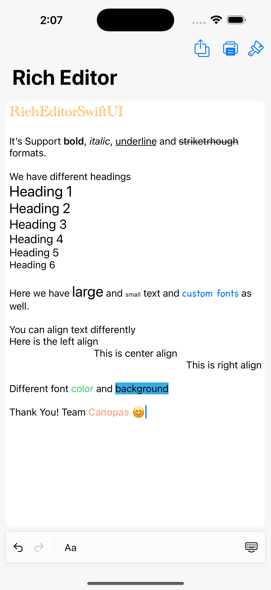
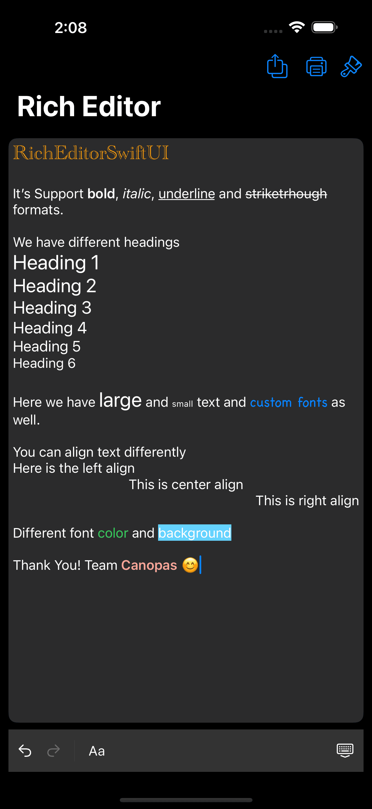
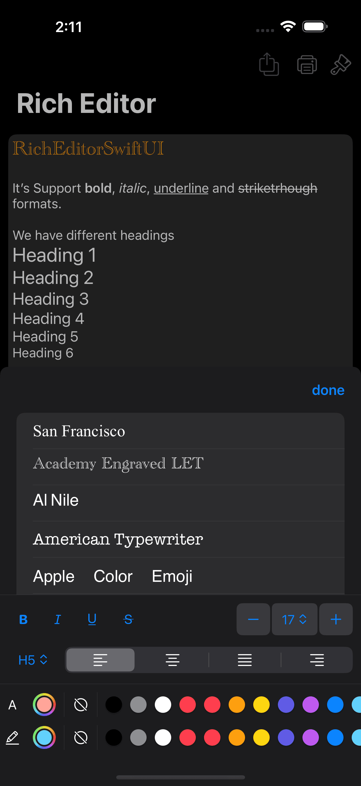
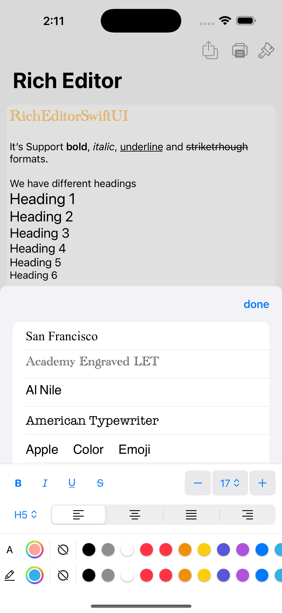
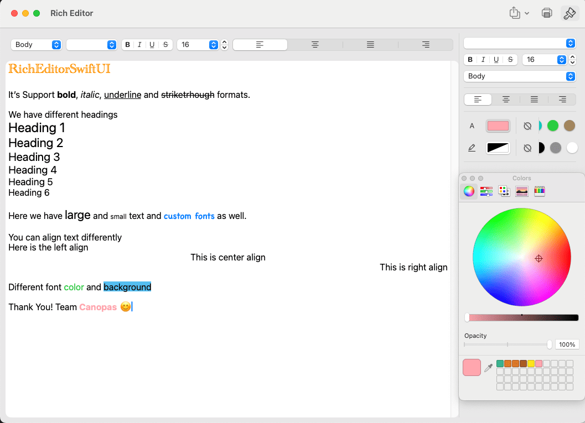
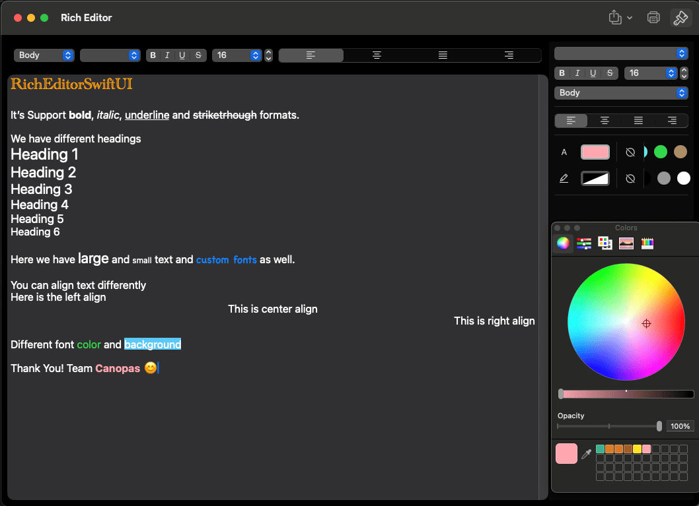

# RichEditorSwiftUI
[](https://img.shields.io/badge/Swift-5.9-Orange?style=flat-square)
[](https://img.shields.io/badge/Platforms-macOS_iOS_tvOS_watchOS_vision_OS_-Green?style=flat-square)
[](https://img.shields.io/cocoapods/v/RichEditorSwiftUI.svg)
[](https://img.shields.io/badge/Swift_Package_Manager-compatible-orange?style=flat-square)


## Features

The editor offers the following <b>options</b>:

- [x] **Bold**
- [x] *Italic*
- [x] <u>Underline</u>
- [x] ~~Strikethrough~~
- [x] Different Heading
- [x] Text Alignment
- [x] Font size
- [x] Font color
- [x] Font family
- [x] Background color
- [x] Export with .txt, .rtf, .pdf, .json

## Screenshots

<table>
  <tr>
    <th width="33%" >Editor light</th>
    <th  width="33%" >Editor dark</th>
  </tr>
  <tr>
    <td></td>
    <td>  </td>
  </tr>
</table>

<table>
  <tr>
    <th width="33%" >Toolbar dark</th>
    <th  width="33%" >Toolbar light</th>
  </tr>
  <tr align="center">
    <td></td>
    <td>  </td>
  </tr>
</table>

<table>
  <tr>
    <th width="100%" >mac Editor light</th>
  </tr>
  <tr align="center">
    <td></td>
  </tr>
</table>

<table>
  <tr>
    <th  width="100%" >mac Editor dark</th>
  </tr>
  <tr align="center">
    <td>  </td>
  </tr>
</table>

## mac Editor video

<div align="center">
  <video src="https://github.com/user-attachments/assets/844d8843-41e9-44c2-8a0c-afedaa55c5cb" width="90%"/>
</div>

## Editor video
<div align="center">
  <video src="https://github.com/user-attachments/assets/f99804fb-8612-4e46-b172-66567d1acf91" width="90%"/>
</div>

## Installation

### Swift Package Manager

The [Swift Package Manager](https://swift.org/package-manager/) is a tool for automating the distribution of Swift code and is integrated into the `swift` compiler. 

Once you have your Swift package set up, adding RichEditorSwiftUI as a dependency is as easy as adding it to the `dependencies` value of your `Package.swift`.

```swift
dependencies: [
    .package(url: "https://github.com/canopas/rich-editor-swiftui.git", .upToNextMajor(from: "1.1.0"))
]
```

### CocoaPods

[CocoaPods][] is a dependency manager for Cocoa projects. For usage and installation instructions, visit their website. To integrate RichEditorSwiftUI into your Xcode project using CocoaPods, specify it in your Podfile:

    target 'YourAppName' do
        pod 'RichEditorSwiftUI', '~> 1.1.0'
    end

[CocoaPods]: https://cocoapods.org

## How to add in your project

Add the dependency

```
 import RichEditorSwiftUI
```

## How to use?

```
struct EditorView: View {
    @ObservedObject var state: RichEditorState = .init(input: "Hello World")

    var body: some View {
        VStack {
            #if os(macOS)
                RichTextFormat.Toolbar(context: state)
            #endif

            RichTextEditor(
                context: _state,
                viewConfiguration: { _ in

                }
            )
            .cornerRadius(10)

            #if os(iOS)
                RichTextKeyboardToolbar(
                    context: state,
                    leadingButtons: { $0 },
                    trailingButtons: { $0 },
                    formatSheet: { $0 }
                )
            #endif
        }
        .inspector(isPresented: $isInspectorPresented) {
            RichTextFormat.Sidebar(context: state)
                #if os(macOS)
                    .inspectorColumnWidth(min: 200, ideal: 200, max: 320)
                #endif
        }
    }
}
```
# Demo
[Sample](https://github.com/canopas/rich-editor-swiftui/tree/main/RichEditorDemo) app demonstrates how simple the usage of the library actually is.

## Tech stack

RichEditorSwiftUI utilizes the latest Apple technologies and adheres to industry best practices. Below is the current tech stack used in the development process:

- MVVM Architecture
- SwiftUI
- Swift
- Xcode

# Bugs and Feedback
For bugs, questions, and discussions please use the [Github Issues](https://github.com/canopas/rich-editor-swiftui/issues).

## Contribution
Currently, we are not accepting any contributions.

## Credits
RichEditor for SwiftUI is owned and maintained by the [Canopas team](https://canopas.com/). For project updates and releases, you can follow them on X at [@canopas_eng](https://x.com/canopas_eng).

A similar library is also available for Android in Jetpack Compose [here](https://github.com/canopas/rich-editor-compose).

RichTextKit: https://github.com/danielsaidi/RichTextKit

<a href="https://canopas.com/contact"></a>

# Licence

```
Copyright 2023 Canopas Software LLP

Licensed under the Apache License, Version 2.0 (the "License");
You won't be using this file except in compliance with the License.
You may obtain a copy of the License at

   http://www.apache.org/licenses/LICENSE-2.0

Unless required by applicable law or agreed to in writing, software
distributed under the License is distributed on an "AS IS" BASIS,
WITHOUT WARRANTIES OR CONDITIONS OF ANY KIND, either express or implied.
See the License for the specific language governing permissions and
limitations under the License.
```
