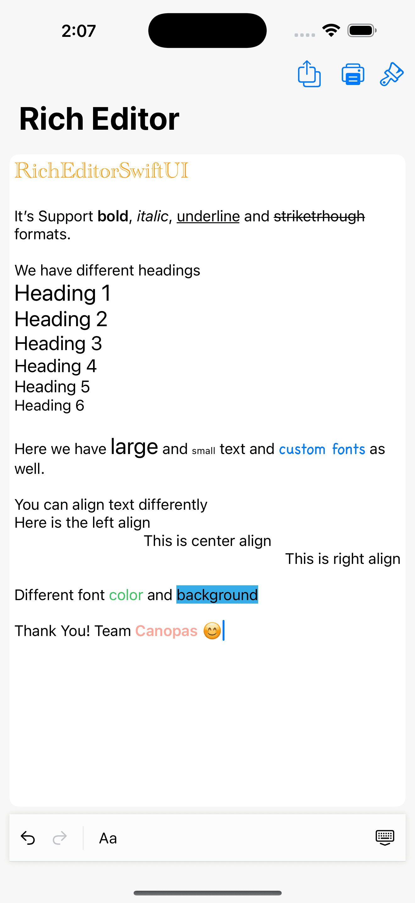
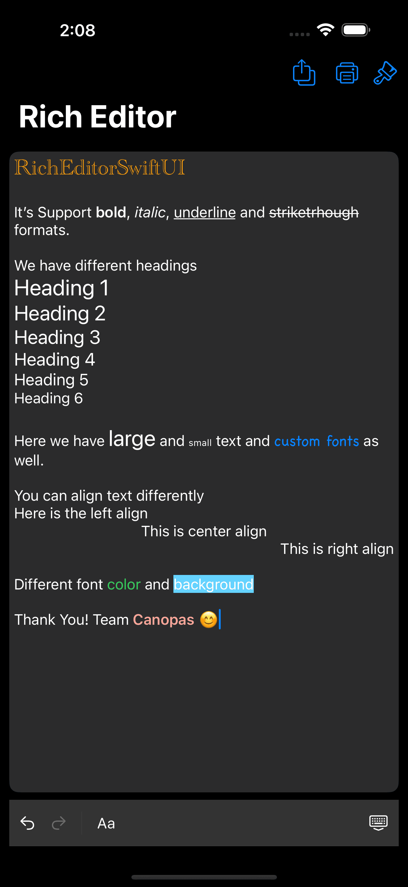
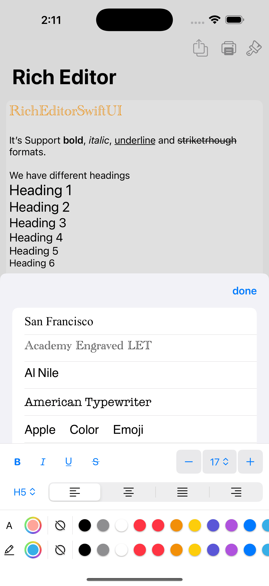
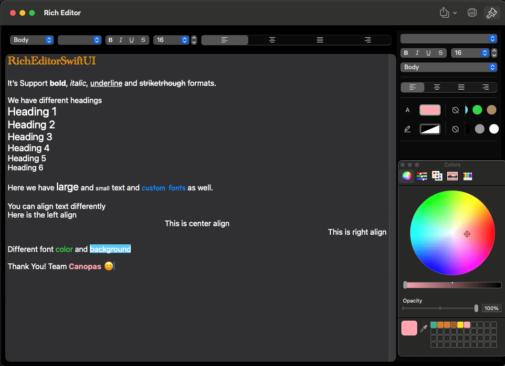

# RichEditorSwiftUI


## Features

The editor offers the following <b>options</b>:

- [x] **Bold**
- [x] *Italic*
- [x] <u>Underline</u>
- [x] Different Heading
- [x] Text Alignment
- [x] Font size
- [x] Font color
- [x] Font family
- [x] Background color
- [x] Export with .txt, .rtf, .pdf, .json

## Screenshots

<table>
  <tr>
    <th width="33%" >Editor light</th>
    <th  width="33%" >Editor dark</th>
  </tr>
  <tr>
    <td></td>
    <td>  </td>
  </tr>
</table>

<table>
  <tr>
    <th width="33%" >Toolbar dark</th>
    <th  width="33%" >Toolbar light</th>
  </tr>
  <tr align="center">
    <td></td>
    <td>  </td>
  </tr>
</table>

<table>
  <tr>
    <th width="100%" >mac Editor light</th>
  </tr>
  <tr align="center">
    <td></td>
  </tr>
</table>

<table>
  <tr>
    <th  width="100%" >mac Editor dark</th>
  </tr>
  <tr align="center">
    <td>  </td>
  </tr>
</table>

## mac Editor video

<div align="center">
  <video src="https://github.com/user-attachments/assets/844d8843-41e9-44c2-8a0c-afedaa55c5cb" width="90%"/>
</div>

## iPhone Editor video
<div align="center">
  <video src="https://github.com/user-attachments/assets/f99804fb-8612-4e46-b172-66567d1acf91" width="90%"/>
</div>

## Installation

### Swift Package Manager

The [Swift Package Manager](https://swift.org/package-manager/) is a tool for automating the distribution of Swift code and is integrated into the `swift` compiler. 

Once you have your Swift package set up, adding RichEditorSwiftUI as a dependency is as easy as adding it to the `dependencies` value of your `Package.swift`.

```swift
dependencies: [
    .package(url: "https://github.com/canopas/rich-editor-swiftui.git", .upToNextMajor(from: "1.1.0"))
]
```

### CocoaPods

[CocoaPods][] is a dependency manager for Cocoa projects. For usage and installation instructions, visit their website. To integrate RichEditorSwiftUI into your Xcode project using CocoaPods, specify it in your Podfile:

    target 'YourAppName' do
        pod 'RichEditorSwiftUI', '~> 1.1.0'
    end

[CocoaPods]: https://cocoapods.org

## How to add in your project

Add the dependency

```
 import RichEditorSwiftUI
```

## How to use?

```
struct EditorView: View {
    @ObservedObject var state: RichEditorState = .init(input: "Hello World")

    var body: some View {
        VStack {
            #if os(macOS)
                RichTextFormat.Toolbar(context: state)
            #endif

            RichTextEditor(
                context: _state,
                viewConfiguration: { _ in

                }
            )
            .cornerRadius(10)

            #if os(iOS)
                RichTextKeyboardToolbar(
                    context: state,
                    leadingButtons: { $0 },
                    trailingButtons: { $0 },
                    formatSheet: { $0 }
                )
            #endif
        }
        .inspector(isPresented: $isInspectorPresented) {
            RichTextFormat.Sidebar(context: state)
                #if os(macOS)
                    .inspectorColumnWidth(min: 200, ideal: 200, max: 320)
                #endif
        }
    }
}
```

## Tech stack

RichEditorSwiftUI utilizes the latest Apple technologies and adheres to industry best practices. Below is the current tech stack used in the development process:

- MVVM Architecture
- SwiftUI
- Swift
- Xcode

# Demo
[Sample](https://github.com/canopas/rich-editor-swiftui/tree/main/RichEditorDemo) app demonstrates how simple the usage of the library actually is.

# Bugs and Feedback
For bugs, questions and discussions please use the [Github Issues](https://github.com/canopas/rich-editor-swiftui/issues).


## Credits
RichEditor for SwiftUI is owned and maintained by the [Canopas team](https://canopas.com/). For project updates and releases, you can follow them on Twitter at [@canopassoftware](https://twitter.com/canopassoftware).

Similar library is also available for Android in Jetpack Compose [here](https://github.com/canopas/rich-editor-compose)

RichTextKit: https://github.com/danielsaidi/RichTextKit

